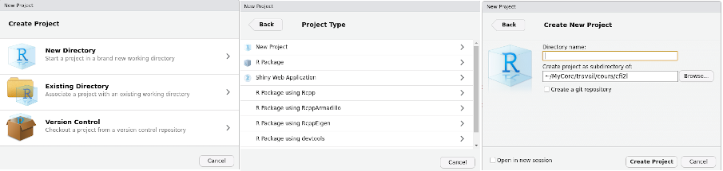
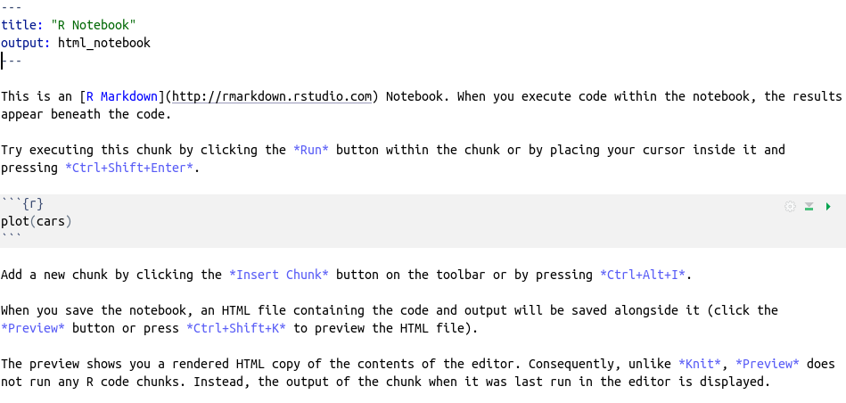
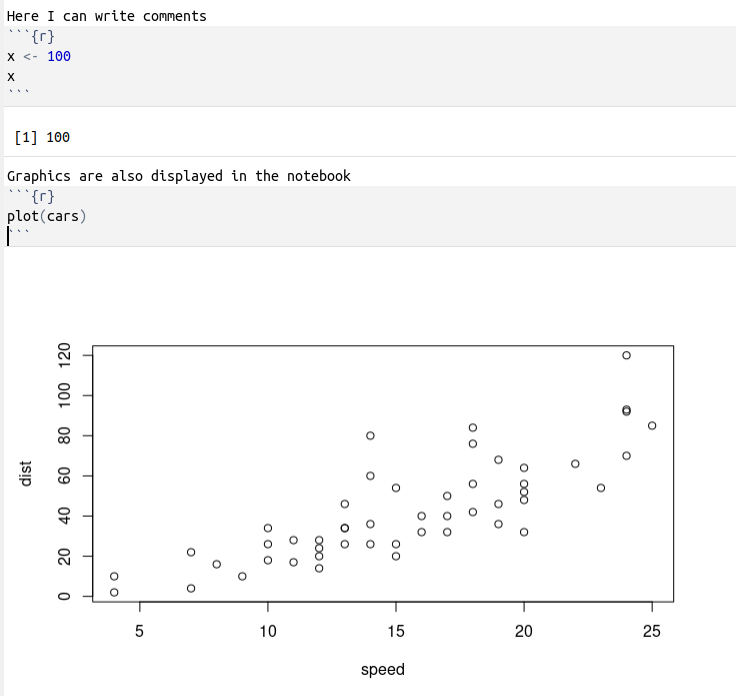
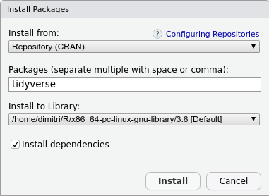
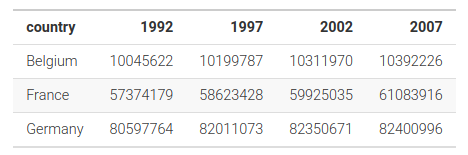
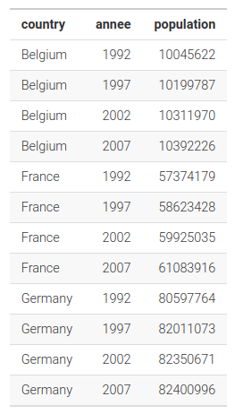

```{r, include=FALSE}
source("script_source.R", local=knitr::knit_global())
```

--- 

**Content**

- [Introduction and installation](#introduction)
- [Rstudio](#rstudio)
- [Data Types and Structures](#data_structures)
- [Dataset Preparation](#dataset_preparation)
- [Dataset Manipulation](#dataset_manipulation)
- [Descriptive Statistics](#descriptive_statistics)
- [Data Visualization](#visualisations)
- [Multivariate Analysis](#multivariate_analysis)
- [Dimensionality Reduction and Cluster Analysis](#dim_reduction_cluster)
- [Sources](#sources)


# Presentation and installation of R {#introduction}

---

-   programming language widely used in data analysis, statistics and scientific research
-   created in 1996 by Ross Ihaka et Robert Gentleman at the University of Auckland, New Zealand
-   developed by statisticians grouped in the *R Development Core Team*
-   GNU GPL Licence
-   website: <https://www.r-project.org/>

<div class="supplementary">
ℹ️ R was created by Ross Ihaka and Robert Gentleman at the University of Auckland, New Zealand, in the early 1990s. The development of R was motivated by the desire for an open-source statistical computing and graphics environment that was accessible to researchers and students. **The name "R" was partly derived from the first letters of the creators' first names, Ross and Robert, and also as a play on the name of the S programming language**, from which R was conceived as an implementation.  

Ross Ihaka, a statistician, and Robert Gentleman, who also has a background in statistics, were both faculty members at the University of Auckland when they began working on R. Their collaboration aimed to create a software environment for their students that was not only free but also flexible enough to perform a wide range of statistical analyses and graphical representations.  

The initial release of R to the public occurred in 1995, and it quickly gained popularity in the statistical computing community due to its open-source nature, allowing users to modify, improve, and distribute the software. **The Comprehensive R Archive Network (CRAN) was established as a repository of R and its packages**, facilitating the contribution and sharing of code by users worldwide.
</div>

---

**Strengths**

-   free and open source
-   multi-platform
-   extensive package ecosystem
-   interpreted, i.e. code can be easily executed
-   variety of tools for manipulating and transforming data (tidyverse packages)
-   high-quality graphics and visualizations, with a large number of parameters for customizations
-   an active community of users

---

**Weaknesses**

-   not easy to learn at first
-   more a Command Line Interface (CLI) than a Graphical User Interface (GUI)

---

**Install**

- R : <https://cran.r-project.org/>
- RStudio : <https://posit.co/>


# RStudio {#rstudio}

---

-   Integrated Development Environment (IDE) dedicated to R
-   user-friendly interface for R
-   free, open source and multi-platform


---

**3 areas**

-   the R interpreter (console) and terminal
-   the session environment, with the list of variables/objects, their type and their value. Also an history tab with the list of past commands
-   the help area, with also the list of R packages

## The R interpreter

-   interprets the code and displays the results
-   the top and bottom arrows to navigate in the history of commands
-   "Enter" key to execute the current line of code

```{r}
10 * 2
```

--- 

-   to store a value one must create a variable and assign the value
-   the assignment operator is `<-`

```{r}
x <- 10
```

-   it means that we assign the value "10" to the variable "x"
-   the variable "x" can be called later, to display its value or make calculations

```{r}
x
```

<div class="supplementary">
ℹ️ The use of `<-` as the assignment operator in R is rooted in its history and the influence of the S language.  
While `<-` is the traditional and recommended assignment operator in R, `=` is also supported for assignment.  
However, the use of `<-` is encouraged in the R community and in coding standards for clarity and tradition.
</div>

--- 

-   once a variable (or an object) is created, it appears in the "Environment" tab
-   lines of codes that have been executed appear in the "History" tab (double click on the line to run it in the console)
-   one can create as many objects as needed, and make calculations with these objects

```{r}
y <- 100
x + y
```

-   variables / objects names can contain letters, numbers and special characters "." and "\_"
-   but can't start by a number or a special character
-   no accent
-   case sensitive, which means that x and X are two different objects

## Project

-   allows you to organize files, data, and code associated with a specific task (e.g. data analysis)
-   it sets the working directory, i.e. the directory in which files will be stored (and loaded) by default for the project
-   avoids to write the absolute path of files each time we need to read or write a file
-   to create a new project : File/New Project
-   either create a new folder on the computer or use an existing one

File/New Project



## Scripts

-   console does not store the code once the session is closed
-   instead of the console, we write the code in a file, called a script, and run the content of the file in the console. It allows to keep track of the code. To create a new script: File/New File/R Script
-   it is a text file, with an `*.R` extension
-   to run the code into the console, either `Run` or `Ctrl + Enter`

## Notebooks

-   a notebook is a document that allows the user to mix executable code, visualizations, and explanatory text in a single, interactive document
-   can be exported in html or pdf
-   easy to read, share, reproduce and maintain

File/New File/R Notebook



--- 

-   title can be changed
-   do not modify the output
-   the text after the three dashes can be deleted, it only serves to explain how the notebooks work
-   block with code are called `chunks`
-   insert/R to insert a new chunk (or `Ctrl + alt + i`)
-   inside the chunk, `Ctrl + Enter` to execute the current line of code, or `Ctrl + Maj + Enter` to execute the whole chunk

---

-   the ouput of the chunk is displayed just below the chunk
-   as soon as you save the notebook, an html file is created



## Markdown

-   text in the notebook can be written with the markdown markup language
-   simple syntax to create headings, emphasis, lists, links, and other basic text formatting
-   simplified html
-   RStudio offer a quick guide : Help/Markdown Quick Reference

## Packages

-   set of user-contributed codes and functions that extend the functionality of R
-   easy to install with `install.packages()` or tab `Packages` and `Install`
-   developed and maintained by the R community
-   handled and stored in the CRAN network (Comprehensive R Archive Network)
-   write the name of the package and click on `Install`
-   to be able to use the package it must be loaded with `library(package_name)`
-   by convention, the `library(xxx)` should be placed at the top of the script/notebook



---

💻 **Practice**

-   create a new project
-   create a new notebook called "basics"
-   install and load the packages `tidyverse` and `questionr`

<div class="supplementary">
ℹ️ The questionr package in R is a useful tool designed primarily for social scientists, providing a set of functions to facilitate the analysis of survey data. It was developed to simplify common tasks associated with survey data analysis, including data manipulation, summarization, and visualization, as well as to provide easy access to descriptive statistics that are particularly relevant in social science research.
</div>


# Data structures {#data_structures}

## Types of data

-   Numeric (whole numbers and decimal numbers)
-   Logical (TRUE/FALSE values)
-   Character (textual data)
-   Factor (categorical data)
-   NA : missing value (Not Available)

and also

-   Complex (complex numbers with real and imaginary parts)
-   POSIXct (date and time values)

typeof(objet) to display the type of an object

```{r}
a <- "hello R world !"
typeof(a)
```

## The vector

-   it's a one-dimensional array where elements are of the same data type
-   can be created with the `c()` function, where `c()` means *concatenate* or *combine*

```{r}
vec_1 <- c(1, 10, 15)
vec_1
```

```{r}
(vec_2 <- c("hello", "world"))
```

💡 The parenthesis in the chunk execute the line of code and displays the output

---

Mathematical operations are applied element-wise.

```{r}
height <- c(1.75, 1.54, 1.85, 1.92)
(height_cm <- height * 100)
```

```{r}
weight <- c(72, 59, 110, 95)
(imc <- weight / height ^ 2)
```

--- 

**Other functions to create a vector**

- to create empty vectors: numeric(), character(), logical()
- if an integer as argument to the function it defines the size of the vector, with default values: 0 for numeric, "" for character and FALSE for logical

```{r}
numeric(10)
```

`:` to create a sequence of numbers that follow each other by an interval of 1

```{r}
1:10
```

---

`seq()` to create a sequence of numbers with custom start, end and step values

```{r}
seq(from=0, to=20, by=4)
```

`rep()` to repeat a vector

```{r}
rep(1:5, times=2)
```

💡 *Notes:* 

- `seq()` and `rep()` have other arguments, see the help with `?seq` and `?rep`.
- There exists functions to generate vectors with random values: `rnorm`, `runif`, `rbinom`, `rpois` etc.

---

**Indexation system**

-   elements can be selected from a vector using square brackets `[]`
-   the first element is indexed as 1
-   to select a single element, provide its index inside the brackets

```{r}
height <- c(1.75, 1.54, 1.85, 1.92)
```

```{r}
height[1]
```

<div class="supplementary">
ℹ️  The decision to start indexing from 1 in R : 

*Ease for Non-programmers*: Many users of R come from academic backgrounds in statistics, mathematics, and various fields of science, where 1-based indexing is the norm. Starting indexes at 1 can be more intuitive for individuals who are not primarily trained in computer science but are using R for data analysis, statistical modelling, and research.

*Alignment with Theoretical Concepts*: In statistical formulas and mathematical expressions, indexes typically start at 1. Using 1-based indexing in R makes it easier to translate these formulas and expressions directly into code without having to adjust the index values.
</div>

---

to select multiple elements, provide a vector of indices inside the brackets

```{r}
height[c(1, 3)]
```

slicing can be used to select a range of elements

```{r}
height[2:4]
```

--- 

### The factor

- a categorical variable (gender, species, political affiliation etc.)
- created by calling the factor function to a vector of values
- R assigns a label to each category and assigns an integer level (1 for the first level, 2 for the second level, and so on)

```{r}
gender <- c("M", "F", "M", "M", "F", "F")
gender
```

```{r}
typeof(gender)
```

```{r}
gender <- factor(gender)
gender
```

---

```{r}
typeof(gender)
str(gender)
```

possible to change the names of the levels with the levels function

```{r}
levels(gender) <- c("Female", "Male")
str(gender)
```

---

### Useful Functions

A function is called by its name, followed by parentheses containing zero, one, or multiple arguments.

- `?function_name` (or `help("function_name")`) to display the function's help documentation.
- Some functions have required arguments and optional arguments.
- In the function signature, required arguments have no default value, while optional arguments do.
- For example, the mean function has one required argument and an optional argument na.rm, which allows ignoring missing values (NA) when calculating the mean.

---

- `length(v)`: returns the length of v (number of elements).
- `mean(v)`: returns the mean of v.
- `min(v)`, `max(v)`: return the minimum (maximum) value of v.
- `sum(v)`: returns the sum of the values in v.
- `range(v)`: returns a vector containing the minimum and maximum values.
- `unique(v)`: returns a vector derived from v with duplicate values removed.

```{r}
mean(height)
```

```{r}
min(height)
```

---

### Combining vectors 

With `rbind` and `cbind`

- `rbind` to combine vectors by row
- `cbind` to combine vectors by column

```{r}
(v1 <- c(1, 2, 3))
(v2 <- c(4, 5, 6))
```

**`rbind`**
```{r}
(rbind(v1, v2))
```

---

**`cbind`**
```{r}
(cbind(v1, v2))
```

---

### Calculating averages on combined vectors

With `rowMeans` and `colMeans`**

- `rowMeans` to calculate the mean by row
- `colMeans` to calculate the mean by column

```{r}
v1 <- seq(1, 10, by=2)
v2 <- seq(2, 20, by=4)
(mat <- cbind(v1, v2))
```

```{r}
rowMeans(mat)
```

```{r}
colMeans(mat)
```

💡 There are also rowSums and colSums for calculating sums.

--- 

💻 **Practice**

**Exercice 1.** With the vectors below, which represent three households:

1. calculate the absolute difference of income between the husband and the wife in each household (function `abs`)
2. calculate the total income of the households
3. calculate the income per person in each household

```{r, eval=F}
husband_income <- c(1200, 1180, 1750, 2100)
wife_income <- c(1450, 1870, 1690, 0)
household_people <- c(4, 2, 3, 2)
```

---

**Exercice 2.** With the vector below:

1.  what is the type of the vector
2.  change the vector as a categorical variable
3.  display the levels and the associated integers
4.  change the level "Ph.D" to "PhD"

```{r}
education_levels <- c("Bachelor", "Master", "Ph.D")
(education <- sample(education_levels, 10, replace = TRUE))
```

💡 `sample()` takes a sample of the specified size from the elements of x using either with or without replacement.  

---

**Exercice 3.** With the vectors below, which represent the note of 6 students in 3 disciplines: 

1. calculate the average of each student
2. calculate the average in each discipline
3. display the quartiles of the python discipline

```{r, eval=F}
python <- c(12, 16, 8, 18, 6, 10)
html <- c(14, 9, 13, 15, 17, 11)
bdd <- c(18, 11, 14, 10, 8, 12)
```

## The dataframe

-   two-dimensional array (with rows and columns), similar to a spreadsheet
-   each column / variable is a vector
-   vectors can be of different data type (number, character, logical, factor)
-   created with the data.frame() function

```{r}
df1 <- data.frame(
  gender=factor(sample(c("M", "F"), 10, replace=T)),
  age=sample(18: 100, 10, replace=T),
  education=education
  )
df1
```

---

We can access to a variable/column/vector in a dataframe with `$`

```{r}
df1$gender
```

```{r}
df1$gender[c(1, 3)]
```

---

Let's take an example dataset, `hdv2003`, provided by the `questionr` package that was previously loaded. We load the dataset with the following command:

```{r}
data("hdv2003")
```

This places the dataset into the working environment.
`hdv2003` is a subset of the *Histoire de vie* survey conducted by INSEE in 2003. It contains 2,000 individuals and 20 variables.

Click on the object in the Environment tab to view the data table (you can also use the function View(hdv2003)).

💡 `data()` written in the console displays all available datasets (R core + loaded libraries).  

---

**Useful functions to discover a dataframe**

- `names(df)`: displays the column names  
- `nrow(df)`: returns the number of rows  
- `ncol(df)`: returns the number of columns  
- `dim(df)`: returns a vector with the dataset dimensions, i.e., `nrow` and `ncol`  
- `names(df)`: returns the variable (column) names  
- `str(df)`: displays information about the dataset – each variable with its type and the first few values (if you click on the blue arrow in the environment, it shows the content of `str(df)`)  
- `head(df)`: displays the first rows  
- `tail(df)`: displays the last rows  

```{r}
dim(hdv2003)
```

```{r}
names(hdv2003)
```

---

💻 **Practice**

Load the dataset `hdv2003` from package `questionr`

1. display the dimensions of the dataset
2. display the names of the variables
3. display the type of the variables

## The matrix

- a two-dimensional array consisting of elements of the same data type
- elements of a matrix are organized in rows and columns

Creation: 

- `matrix(data, nrow, ncol, byrow=FALSE, dimnames=NULL)`
- `diag(n)` : diagonal matrix with `n` ones on the diagonal
- `diag(v)` : diagonal matrix with the vector `v` on the diagonal

```{r}
# 3x3 matrix with values from 1 to 9
matrix(1:9, nrow = 3, ncol = 3, byrow = TRUE)
```

---

**Matrix operations**

- `%*%` : matrix product
- `t(mat)` : matrix transpose
- `solve(mat)` : matrix inverse
- `det(mat)` : matrix determinant

ℹ️ *More info:*

-   <https://r-coder.com/matrix-operations-r/?utm_content=cmp-true>
-   <https://www.statmethods.net/advstats/matrix.html>

## The array

- a multi-dimensional data structure that can store data in more than two dimensions
- similar to matrices but are generalized to an arbitrary number of dimensions
- `array()` function to create arrays.
- like matrices, all elements in an array must be of the same data type.

```{r}
(my_array <- array(1:18, dim = c(3, 3, 2)))
```

## The list

- can contain different types of data / objects
- created using the `list()` function and elements are separated by commas
- similar to a dictionary in other languages (with pairs of key / value)

```{r}
mylist <- list("my_vector"=1:10, "my_sentence"="Hello world!")
mylist
```

an element can be accessed by its name with `$`

```{r}
mylist$my_vector
```


# Dataset preparation {#dataset_preparation}

---

**The tidyverse**

Set of libraries aimed at facilitating the management of the dataset (data cleaning, data wrangling, preprocessing)

`library(tidyverse)`


readr (import of data), tibble (new dataframe), forcats (qualitative variables), stringr (for characters), tidyr (data formatting), dplyr (data manipulation), ggplot2 (visualization), purrr (programming)

## The Tibble

- modern version of the data frame
- compared to the dataframe, the tibble
    + has no rownames
    + allows column names with spaces, special characters, numbers etc.
    + is displayed optimally in the console, over a few lines and with some information about each variable
- functions and libraries of the tidyverse accept a dataframe as argument but return a tibble

```{r}
as_tibble(hdv2003)
```

## Loading a dataset

- csv format is a good practice and a standard to share data
- 2 functions: read_csv and read_csv2
- read_csv: "," as separator and "." as decimal
- read_csv2: ";" as separator and "," as decimal

💡 *Notes:*

- There exists also `read_excel`, `read_stata`, `read_sas`  etc. to import data from other formats.
- RStudio provides a graphical interface to import data, by clicking on "Import Dataset" in the environment tab

## Exporting data

To export a dataset in a csv file, there exists write_csv and write_csv2.

**Serialization**  

- Used to save R objects in R format  
- Allows saving multiple R objects in a single file (extension `*.Rdata`)  
- Function `save(objects, file="file.Rdata")`  
- Function `load("file.Rdata")` to reload the objects into the R session environment  

## Recoding categorical variables

With forcats {#forcats}

### Rename the levels

`fct_recode` to rename the levels

```{r}
freq(hdv2003$qualif)
```

💡 *The `freq` function from the `questionr` package provides information on a categorical variable: counts, percentages (with and without NAs).* (`?questionr::freq`).  

---

💡 *The categories of a categorical variable are called `levels`.*  

```{r}
levels(hdv2003$qualif)
```

---

`fct_recode(vector, new name = old name, ...)`

```{r}
hdv2003$qualif_grouped <- fct_recode(
  hdv2003$qualif,
  "Ouvrier_spe" = "Ouvrier specialise",
  "Ouvrier_qual" = "Ouvrier qualifie",
  "Interm" = "Profession intermediaire"
)
freq(hdv2003$qualif_grouped)
```

---

to recode a factor as a missing value (NA), set NULL as new name

```{r}
hdv2003$qualif_grouped <- fct_recode(hdv2003$qualif_grouped, NULL="Autre")
freq(hdv2003$qualif_grouped)
```

---

**To code the NA values as a factor**, use `fct_na_value_to_level`

```{r}
levels(hdv2003$qualif_grouped)
```

```{r}
hdv2003$qualif_grouped <- fct_na_value_to_level(hdv2003$qualif_grouped)
levels(hdv2003$qualif_grouped)
```

---

### Group some levels

`fct_collapse` 

```{r}
hdv2003$qualif_rec <- fct_collapse(
  hdv2003$qualif, 
  "Ouvrier"=c("Ouvrier specialise", "Ouvrier qualifie"), 
  "Interm"=c("Technicien", "Profession intermediaire"))
freq(hdv2003$qualif_rec)
```

💡 *Notes:*  

1. `fct_other()` to group a set of categories into the "Other" category.  
2. `fct_lump()` to group the least frequent categories into the "Other" category.  
3. Graphical interface provided by `questionr`, accessible via **`Addins`** → **`Levels Recoding`**.  

---

### Reorder the levels

```{r}
hdv2003$qualif_rec <- fct_relevel(
    hdv2003$qualif,
    "Cadre", "Profession intermediaire", "Technicien", 
    "Employe", "Ouvrier qualifie", "Ouvrier specialise",
    "Autre"
)
freq(hdv2003$qualif_rec)
```

```{r}
str(hdv2003$qualif_rec)
```

---

💻 **Practice**

1. with the hdv2003 dataset, recode the variable *relig* in order to get

```         
                              n    % val%
Pratiquant                  708 35.4 35.4
Appartenance                760 38.0 38.0
Ni croyance ni appartenance 399 20.0 20.0
Rejet                        93  4.7  4.7
NSP                          40  2.0  2.0
```

2. recode the variable *nivetud* to get

```         
                                          n    % val%
N'a jamais fait d'etudes                 39  2.0  2.1
Études primaires                        427 21.3 22.6
1er cycle                               204 10.2 10.8
2eme cycle                              183  9.2  9.7
Enseignement technique ou professionnel 594 29.7 31.5
Enseignement superieur                  441 22.0 23.4
NA                                      112  5.6   NA
```

3. reorder the factors of this variable to get

```         
                                         n    % val%
Enseignement superieur                  441 22.0 23.4
Enseignement technique ou professionnel 594 29.7 31.5
2eme cycle                              183  9.2  9.7
1er cycle                               204 10.2 10.8
Études primaires                        427 21.3 22.6
N'a jamais fait d'etudes                 39  2.0  2.1
NA                                      112  5.6   NA
```

---

## Create a categorical variable

*from a numeric variable*

With `cut` function

- Creating classes from a numerical variable  
- Example: an income variable  
- The `breaks` argument allows defining class intervals  

`breaks=number`: the interpreter will create `number` classes of equal width  

```{r}
hdv2003$age_classe <- cut(hdv2003$age, breaks=5)
freq(hdv2003$age_classe)
```

---

`breaks=vector`: the interpreter will create classes according to the values in the vector

```{r}
hdv2003$age_classe2 <- cut(
    hdv2003$age, 
    breaks = c(18, 25, 35, 45, 55, 65, 100), 
    include.lowest = T
)
freq(hdv2003$age_classe2)
```

💡 package *questionr* provides a graphical interface for *cut*: Addins/Numeric range dividing

---

**`if_else`**

- for a binary situation
- *if_else* takes 3 arguments, the test, the value if the result of the test is TRUE and the value if it is FALSE

```{r}
v <- c(12, 14, 8, 16, 4)
if_else(v > 10, "greater than 10", "lower than (or equal to) 10")
```

the test can be built with several conditions

```{r}
hdv2003$statut <- if_else(
    hdv2003$sexe == "Homme" & hdv2003$age > 60,
    "Men over 60",
    "Other"
)
freq(hdv2003$statut)
```

---

**`case_when`**

an extension of *if_else* when several conditions are needed.  
It is written as condition \~ value  
⚠️tthe conditions are tested sequentially, so it is necessary to start from the most specific condition

```{r}
hdv2003$statut <- case_when(
    hdv2003$age > 60 & hdv2003$sexe == "Homme" ~ "Man over 60",
    hdv2003$age > 50 & hdv2003$sexe == "Femme" ~ "Woman over 50",
    TRUE ~ "Other"
)
freq(hdv2003$statut)
```

As TRUE is always TRUE, all the other values will be coded as "Other".

---

💻 **Practice**

1.  cut the variable heures.tv to get the following frequency table

```         
       n   %    val%
[0,1]  684 34.2 34.3
(1,2]  535 26.8 26.8
(2,4]  594 29.7 29.8
(4,6]  138  6.9  6.9
(6,12]  44  2.2  2.2
NA       5  0.2   NA
```

2.  with *if_else*, create the variable *cinema_bd* which groups individuals who go to cinema and read bd. Others are put in the category "Other". The result should be similar to

```         
               n    % val%
Autre        1971 98.6 98.6
Cinéma et BD   29  1.5  1.5
```

3.  with *case_when* create the variable *gender_bs* with the following categories : Man with more than 2 brothers and sisters, Woman with more than 2 brothers and sisters, Other. The expected result is

```         
                                         n    % val%
Other                                  1001 50.0 50.0
Woman with more than 2 B&S             546  27.3 27.3
Man with more than 2 B&S               453  22.7 22.7
```

## Data formatting

to manipulate the data, it has to be well organized, "tidy":

-   each variable is in a unique column
-   each column contains only one variable
-   each row corresponds to one observation for each variable
-   cells represent the values of each observation for each variable


---

example of a non-tidy dataset: population of 3 countries over 4 years



for this dataset to be "tidy", we need

- one observation per row (here 4)
- a variable "year" and a variable "population"

---

The dataset should be of the form



---

**`pivot_longer`**

Function *pivot_longer* to create a longer dataset, i.e. with more rows

```{r, echo=F}
tidy_ex <- data.frame(country=c("Belgium", "France", "Germany"), `2002`=c(10311970, 59925035, 82350671), `2007`=c(10392226, 61083916, 82400996))
colnames(tidy_ex)[2:3] <- c("2002", "2007")
print(tidy_ex)
```

columns 2002 and 2007 should be in a columns "year" and the values in a columns "population"

```{r}
pivot_longer(data=tidy_ex, cols=c("2002", "2007"), names_to="annee", values_to="population")
```

---

**`pivot_wider`**

Function *pivot_wider* to create a wider dataset, i.e. with more columns

```{r, echo=F}
tidy_ex1 <- data.frame(country=c(rep("Belgium", 4), rep("France", 4)), continent=rep("Europe", 8), year=rep(c(rep(2002, 2), rep(2007, 2)), 2), variable=rep(c("lifeExp", "pop"), 4), value=c(78.320, 10311970.000, 79.441, 10392226.000, 79.590, 59925035.000, 80.657, 61083916.000))
tidy_ex1
```

the column "variable" should be divided in two variables, lifeExp and pop

```{r}
pivot_wider(data=tidy_ex1, names_from=variable, values_from=value)
```

---

💡 *Notes:*

- `separate` and `unite` functions to separate and unite columns
- `separate_rows` to separate a column into several rows
- `complete` function to complete missing combinations


# Dataset Manipulation {#dataset_manipulation}

---

`dplyr` provides functions that facilitates data manipulation

For the examples, we use the datasets from the package nycflights23.  
This is the flight data of 3 airports of New-York in 2023.  
It is necessary to install the package `nycflights23` and then to load the three datasets

```{r, eval=F}
data("flights")
data("airports")
data("airlines")
```

---

### slice

To select rows based on their index in the dataset

```{r}
slice(airports, 2:8)
```

---

### filter

To select rows in the dataset based on conditions.

Example: all the flights of january

```{r}
filter(flights, month==1)
```

---

Several conditions

Example: all the flights with departure delay between 10 and 15 minutes

```{r}
filter(flights, dep_delay >= 10 & dep_delay <= 15)
```
💡 `filter` can be used with `&` (AND) and `|` (OR) operators.


---

Possible to supply the result of a function as a condition

Example: flights with the longest distance

```{r}
filter(flights, distance == max(distance))
```

---

### select

select some columns in the dataset

Example: latitude and longitude

```{r}
select(airports, lat, lon)
```

---

if we add "-" before the name of the columns it displays all the columns except the one listed

```{r}
select(airports, -lat)
```

---

possible to add arguments to give conditions on the columns returned

```{r}
select(flights, starts_with("dep_"))
```

exists also *ends_with*, *contains* and *matches*

---

`select` can rename the columns 'on the fly'

```{r}
select(airports, latitude=lat, longitude=lon)
```

---

### rename

to rename the columns, function rename

```{r}
rename(airports, longitude=lon, latitude=lat, altitude=alt)
```

💡 if the new name (or the old one) contains a space quotes are necessary

---

### arrange

to sort the dataset according to one or several columns

```{r}
arrange(flights, dep_delay)
```

---

function `desc()` to reverse the order

```{r}
arrange(flights, desc(dep_delay))
```

---

several columns

```{r}
arrange(flights, month, dep_delay)
```

---

### mutate

to create new columns/variables

Creation of a column named air_time_hours

```{r}
flights <- mutate(flights, air_time_hours = air_time / 60)
```

---

possible to create several columns at once

```{r}
flights <- mutate(
    flights,
    distance_km = distance / 0.62137,
    speed = distance_km / air_time_hours
)
select(flights, "Air time"=air_time_hours, "Distance (km)"=distance_km, "Speed"=speed)
```

---

### The pipe

Actions can be chained with the `pipe`. The pipe operator is `|>`.

```{r}
flights |>
  filter(dep_delay >= 10 & dep_delay <= 15) |>
  arrange(desc(dep_delay)) |>
  select(flight, origin, dest, dep_delay, air_time_hours, distance_km, speed) |>
  head(5)
```

⚠️ the actions are chained (pipeline), but nothing is stored. To keep a track of these actions you have to start with an assignment to an object.

```{r}
delays <- flights |>
  filter(dep_delay >= 10 & dep_delay <= 15) |>
  arrange(desc(dep_delay)) |>
  select(flight, origin, dest, dep_delay, air_time_hours, distance_km, speed)
```

The result of the pipeline will be stored in the `delays` object

---

💻 **Practice**

1.  display rows 100 to 105 (dataset flights)
2.  display the flights of july
3.  display the flights that had a delay (arr_delay) between 5 and 15 minutes. The result must be displayed in descending order.
4.  select the columns name, lat and lon of the airports dataset airports and display lat and lon with the names latitude and longitude
5.  in the airports dataset, create a new variable alt_metres which contains the altitude in the metric system (convert feet to meters by dividing the variable by 3.28).

---

### group_by

- allows to apply a function to grouped data
- example: we group the data by month and display the first index of each group (combination of `group_by` and `slice`)

```{r}
flights |> group_by(month) |> slice(1)
```

---

Group the data by company, calculate the average delay and place the result in a new variable called mean_delay (combination of `group_by` and `mutate`)  
`mean_delay` is the average delay of each company

```{r}
flights |>
  group_by(carrier) |>
  mutate(mean_delay = mean(dep_delay, na.rm=T)) |>
  slice(1) |>
  select(carrier, mean_delay)
```
💡 See later `summarise` to get the same information.

---

Group the data by month and display the flights with the longest delay (combination of `group_by` and `filter`)  
*displays the flights with the longest delay for each month*

```{r}
flights |>
  group_by(month) |>
  filter(dep_delay == max(dep_delay, na.rm=T)) |>
  select(month, dep_delay, carrier, origin, dest) |>
  arrange(month)
```

---

possible to group by several variables

```{r}
flights |>
  group_by(month, carrier) |>
  filter(dep_delay == max(dep_delay, na.rm=T)) |>
  select(month, carrier, dep_delay) |>
  arrange(month, carrier)
```

---

### summarise

It allows to calculate a summary statistic on a variable.

```{r}
flights |>
  summarise(
    mean_dep_delay=mean(dep_delay, na.rm=T),
    mean_arr_delay=mean(arr_delay, na.rm=T)
  )
```

---

Combined with `group_by`, `summarise` is extremely powerful.

*Display the average delay of each company and arrange the result from the longest delay to the shortest*

```{r}
flights |>
  group_by(carrier) |>
  summarise(mean_dep_delay=mean(dep_delay, na.rm=T)) |>
  arrange(desc(mean_dep_delay))
```

---

**`n=n()`**

To get the information about the number of observations used to make the calculations

```{r}
flights |>
  group_by(carrier) |>
  summarise(
    mean_dep_delay=mean(dep_delay, na.rm=T),
    n=n()
  ) |>
  arrange(desc(mean_dep_delay))
```

---

With two variables in `group_by`

```{r}
flights |> 
  group_by(month, dest) |>
  summarise(n=n()) |>
  arrange(desc(n))
```

---

💡 If only the effectives are needed, the `count` function can be used

```{r}
flights |> 
  count(month, dest) |>
  arrange(desc(n))
```

---

Variable calculated by the `summarise` function can be used to create an new variable with `mutate`

```{r}
flights |> 
  group_by(month, dest) |>
  summarise(n=n()) |>
  mutate(pourcentage=n/sum(n) * 100) |>
  arrange(desc(pourcentage)) |> 
  head()
```

---

💻 **Practice**

1.  display the number of flights by month and display the result in ascending order
2.  calculate the number of flights to Los Angeles (code LAX) for each month
3.  calculate the number of flights by month and by destination and display only the max
4.  calculate the number of flights by month and create a variable that displays the percentage it represents of the annual flights


# Descriptive statistics {#descriptive_statistics}

---

ℹ️ Descriptive statistics are numerical summaries that describe and summarize the features of a dataset.  

- the first step consists in examining each variable separately (univariate analysis)
- the second step consists in exploring the relationships between pairs of variables (bivariate analysis)
- the third step consists in examining the relationships between multiple variables simultaneously (multivariate analysis). This can involve techniques such as regression analysis, factor analysis, principal component analysis, cluster analysis etc.

*Use of `hdv2003`*

## Univariate analysis

The analysis depends on the type of the variable: 

- quantitative (age, income, etc.) -> numeric vector
- qualitative (gender, profession, etc.) -> factorial vector

---

### Quantitative variable

- simple statistics: minimum, maximum, mean, median, variance, standard-deviation
- corresponding functions are min(), max(), range(), mean(), median(), var(), sd()
- one can also compute the quartiles with the quantile function

The `summary()` function displays all this information directly

```{r}
summary(hdv2003$age)
```

---

### Qualitative variable

the `table()` function counts the number of observations of each category/factor - it is called a contingency table

- add the argument `useNa="ifany"` to count for the NA values
- The summary() function applied on a categorical variable calls this table function

```{r}
table(hdv2003$qualif, useNA="ifany")
```

---

If percentages are preferred over effectives, use the function `prop.table` with the result of the `table` function as argument

```{r}
prop.table(table(hdv2003$qualif, useNA="ifany")) * 100
```

---

the `questionr` package provides the `freq()` function  
useful arguments: valid=F to hide the "valid" columns (columns with NA values); total=T to add a row with the total, and sort="dec" (or "inc") to display values in the decreasing (increasing) order

```{r}
freq(hdv2003$qualif, valid=F, total=T, sort="dec")
```

---

💻 **Practice**  

1. analyse the variable `heures.tv`
2. analyse the variable `trav.imp`


## Bivariate analysis

- to analyse the relationship between two variables
- the analyse depends on the types of the variables
  + both qualitative
  + one qualitative and one quantitative
  + both quantitative

---

### Two qualitatives variables

a contingency table with the `table` function, with two vectors

```{r}
(tb_prof_genre <- table(hdv2003$qualif, hdv2003$sexe))
```

---

- the `prop.table` function computes the percentages
- use the `margin` argument to indicate the axis (row=1, column=2) by which the percentages must be computed

```{r}
prop.table(tb_prof_genre, margin=1) * 100
```

`round()` to set the number of decimals

```{r}
round(prop.table(tb_prof_genre, margin=1) * 100, 2)
```

---

If we change the axis, the interpretation is different. Below the distribution of professions for each gender.

```{r}
round(prop.table(table(hdv2003$qualif, hdv2003$sexe), margin=2) * 100, 2)
```

---

*questionr* provides 2 functions, *lprop* and *cprop* (with one decimal by default)

```{r}
lprop(tb_prof_genre)
```

some useful arguments: add "%", add effectives and change the number of decimals

```{r}
lprop(tb_prof_genre, percent=T, n=T, digits=2)
```

---

**Statistical test**

- we can test for the independence of the two variables with a $\chi^2$
- $H_0$: the two variables (profession and gender) are independent

```{r}
chisq.test(tb_prof_genre)
```

- **X-squared** is the test value, it is a measure of the distance between the data and a theoretical distribution under the hypothesis that the two variables are independents
- **df** is the degree of freedom
- **p-value** is the probability that $H_0$ is observed. The p-value is lower than 5%, the standard threshold, so we reject $H_0$ and conclude that the two variables are not independent from each other.

---

### One qualitative and one quantitative variable

Is the distribution of the numerical (quantitative) variable significantly different across the various levels of the categorical (qualitative) variable?

The mean of the quantitative variable for each category of the qualitative variable

```{r}
hdv2003 |> 
  group_by(sport) |>
  summarise(mean(age))
```

---

**Statistical test**

Test whether the average age is different depending on whether the individual practices sport or not.

If the quantitative variable follows a normal distribution use the *ttest* (student) parametric test, otherwise the *Mann-Whitney* test.\
*if the qualitative variable has more than 2 levels, use the ANOVA test (parametric, `aov()`) or Kruskal-Wallis test (non parametric, `kruskal.test()`)*

To test the normality of the distribution, we can use the *shapiro* test. $H_0$ the vector follows a normal distribution

```{r}
shapiro.test(hdv2003$age)
```

the p-value is lower than 5% so we reject $H_0$, the non-parametric MW test must be used

---

**Mann-Whitney test** : wilcox.test with the argument paired=F because the sample are drawn from different populations (athletes and non-athletes are not the same individuals)

```{r}
wilcox.test(age ~ sport, data=hdv2003, paired=F)
```

**Student test** ($H_0$: the average age is not significantly different between athletes and non-athletes)

```{r}
t.test(age ~ sport, data=hdv2003)
```

In both cases the p-value is lower than 5% which means that the age of athletes is significantly different (here lower) than the age of non-athletes.

---

### Two quantitative variables

Load a new dataset, provided by *`questionr`*

```{r}
data("rp2018")
```

These are data on French municipalities with more than 2000 inhabitants `?rp2018` for a description

```{r}
names(rp2018)
```

---

**Correlation coefficient**

The coefficient varies between -1 and +1, it measures the strength and the direction of the relation between two quantitative variables. A coefficient close to -1 indicates a strong negative relation (when one variable increases the other decreases), and a coefficient close to 1 a positive relation (both variables go in the same direction).

```{r}
cor(rp2018$cadres, rp2018$dipl_sup)
```

---

The statistical test can be called with the `cor.test()` function

$H_0$ : the coefficient is equal to 0

```{r}
cor.test(rp2018$cadres, rp2018$dipl_sup)
```

we reject $H_0$, the correlation between the two variables is significantly different from zero

💡 If the relation is not linear the **Spearman correlation test** (based on ranks) is more suitable : `cor.test(rp2018$cadres, rp2018$dipl_sup, method="spearman")`

---

💻 **Pratice**

With the dataset *rp2018*

1. Analyse the relation between region and pop_chom : 
  - calculate the average number of unemployed people by departement 
  - test if the average number of unemployed people is different between the regions
2. Analyse the relationship between pop_tot and pop_chom


# Data Visualization {#visualisations}

---

With `ggplot2` package

*We use a subset of the dataset `rp2018`*

```{r}
rp <- rp2018 |> filter(departement %in% c("Oise", "Rhône", "Hauts-de-Seine", "Lozère", "Bouches-du-Rhône"))
head(rp)
```

---

**Basic principles of ggplot2**  

- Initialize the graphic function with `ggplot()`  
- Add graphical elements using `geom_` (histogram, scatter plot, boxplot, bars, curves, ...)  
- Customize the graphics using arguments in `geom_` functions and `aes()`  
- The `aes()` function maps dataset variables to graphical elements  

## One variable

### Histogram

**`geom_histogram`** to display the distribution of a quantitative variable

```{r, fig.height=3.5}
ggplot(data=rp) +
  geom_histogram(aes(x=cadres))
```

---

3 options to control the binning of data: 

- bins = X: Specify the number of bins directly. X represents the desired number of bins. This method allows ggplot2 to automatically calculate the bin width based on the range of the data and the specified number of bins.
- binwidth = X: Set the width of each bin. X represents the desired width of each bin. This gives you direct control over the size of the bins but indirectly determines the number of bins based on the data range.
- breaks = vector: Define the bin edges explicitly. In this case, you provide a numeric vector that specifies the boundaries of the bins. This method offers the highest level of control, allowing you to specify irregular bin widths if needed.

---

```{r, fig.height=4}
ggplot(data=rp) +
  geom_histogram(aes(x=cadres), breaks=seq(0, 60, 10))
```

---

### Density plot

**`geom_density`**: to display the density of a quantitative variable

```{r, fig.height=4}
ggplot(data=rp) +
  geom_density(aes(x=cadres))
```

---

Both histogram and density plot can be displayed on the same graph\
`aes(y=after_stat(density))` to display the density on the y-axis

```{r, fig.height=4}
ggplot(data=rp, aes(x=cadres)) +
  geom_histogram(aes(y=after_stat(density)), breaks=seq(0, 60, 10)) +
  geom_density()
```

---

### Boxplot 

**`geom_boxplot`**: another graph that can be used to visualize a quantitative variable.

- the box represents the first quartile (25% of the observations), the median (50%) and the third quartile (75%)
- the main rectangle therefore represent 50% of the observations (25% are below and 25% are above)
- the whiskers represent 1.5 times the inter-quartile. \
*[If one or several values are outside these whiskers they are displayed as points. Sometimes we consider theses values as outliers (additional tests must be made to be sure they can be removed from the analysis)]{style="font-size:0.85em"}*

---

```{r, fig.height=4}
ggplot(data=rp) +
  geom_boxplot(aes(y=cadres)) 
```

---

One boxplot for each modalities of a qualitative variable

```{r, fig.height=4}
ggplot(data=rp) +
  geom_boxplot(aes(x=departement, y=cadres))
```

---

`varwidth=T` to have the width of the boxes proportional to the number of observations in each group

```{r, fig.height=4}
ggplot(data=rp) +
  geom_boxplot(aes(x=departement, y=cadres), varwidth=T)
```

---

### Barplot

**`geom_bar`**: to display the effectives of each category of a qualitative variable

```{r, fig.height=4}
ggplot(rp) +
  geom_bar(aes(x=departement))
```

---

To display the proportions, we need to use `after_stat(prop)` with `group=1` to calculate the proportion for the whole dataset

```{r, fig.height=4}
ggplot(rp) +
  geom_bar(aes(x=departement, y=after_stat(prop), group=1))
```

---

Another solution is to use `geom_col` to display calculated values

```{r, fig.height=4}
rp |> 
  group_by(departement) |> 
  summarise(n=n()) |> 
  mutate(percent=n/sum(n)*100) |>
  ggplot() +
  geom_col(aes(x=departement, y=percent))
```

---

The slight difference between `geom_bar(after_stat)` and `geom_col with summarise` lies in when proportions are computed:

1. `geom_bar()`: automatically counts occurrences and applies after_stat(prop) at the plotting stage. Proportions are computed after binning, which may introduce slight rounding differences.

2. `summarise() + geom_col()`: counts (n = n()) and proportions (n / sum(n) * 100) are pre-computed before plotting. This guarantees a direct control over displayed percentages.

💡 Use `geom_bar()` for a quick approach without preprocessing and `geom_col()` for full control over calculations and additional statistics.

---

### Pie

**`geom_col` with polar coordinates**  
ggplot2 does not provide a `geom_pie` function, but it is possible to create a pie chart with `geom_bar` and polar coordinates

```{r, fig.height=3.5}
rp |> 
  group_by(departement) |> 
  summarise(n=n()) |> 
  mutate(percent=n/sum(n)*100) |>
  ggplot() +
  geom_col(aes(x="", y=percent, fill=departement)) + 
  coord_polar("y", start=0)
```

## Two variables

### Scatter plot

**`geom_point`**

```{r, fig.height=4}
ggplot(data=rp2018) +
  geom_point(aes(x=cadres, y=dipl_sup))
```

---

to add the regression line in the graph, use the geom_smooth function

```{r, fig.height=3.75}
ggplot(data=rp2018, aes(x=cadres, y=dipl_sup)) +
  geom_point() +
  geom_smooth(method="lm")
```

💡 Since the aes function should be used twice, we can add it in the ggplot call

---

### Line plot

**`geom_line`**

Load dataset 'economics' from the package 'ggplot2'

```{r}
data(economics, package="ggplot2")
```

```{r, fig.height=4}
ggplot(data=economics) +
  geom_line(aes(x=date, y=unemploy))
```

## Three and four variables

### Mapping

- associate an attribute of the graph (color, point size, marker) to the value of a categorical variable
- the mapping is done in the aes function

```{r, fig.height=3.5}
ggplot(rp) +
  geom_point(aes(x = dipl_sup, y = cadres, color = departement))
```

---

A fourth dimension through the size of the points which represents the total population of the commune

```{r, fig.height=4}
ggplot(rp) +
  geom_point(aes(x=dipl_sup, y=cadres, color=departement, size=pop_tot))
```

---

Possible to customize a mapping with `scale_`

```{r, fig.height=4}
ggplot(rp) +
  geom_point(aes(x=dipl_sup, y=cadres, color=departement, size=pop_tot)) +
  scale_size("Population", breaks=c(0, 5000, 10000, 50000, 100000), range=c(0, 10))
```

---

### Faceting

Repeat a graph several times according to one or several variables

```{r, fig.height=4}
ggplot(rp) +
  geom_histogram(aes(x=cadres)) +
  facet_wrap(vars(departement))
```

---

```{r, fig.height=4}
ggplot(rp) +
  geom_point(aes(x=dipl_sup, y=cadres, color=pop_tot)) + 
  facet_wrap(~departement)
```

## Custumization

### Titles and labels

`labs` function to add titles and labels

```{r, fig.height=4}
ggplot(rp) +
  geom_point(aes(x=dipl_sup, y=cadres, color=pop_tot)) + 
  labs(title="Relation between Executives and Graduates", x="Graduates", y="Executives")
```

---

### Axes

`scale_x_continuous`, `scale_y_continuous` to customize the axes

```{r, fig.height=4}
ggplot(rp) +
  geom_point(aes(x=dipl_sup, y=cadres, color=pop_tot)) + 
  scale_x_continuous("Graduates", breaks=seq(0, 60, 10), limits=c(0, 60)) +
  scale_y_continuous("Executives", breaks=seq(0, 60, 10), limits=c(0, 60))
```

---

`scale_x_discrete`, `scale_y_discrete` for qualitative variables

```{r, fig.height=4}
ggplot(rp) +
  geom_bar(aes(x=departement)) + 
  scale_x_discrete("Departement") +
  scale_y_continuous("Number of observations")
```

---

### Legend title

With labs

```{r, fig.height=4}
ggplot(rp) +
  geom_point(aes(x=dipl_sup, y=cadres, color=pop_tot)) + 
  labs(color="Population")
```

---

**Practice**

With the dataset rp2018

-   a geom_point with x=dipl_aucun and y=ouvr, with axes' labels, and points in the blue color
-   same graph than above with a color mapping on region
-   boxplot: distribution of the variable proprio depending on the size of the department (pop_cl)
-   geom_point with x=dipl_sup and y=cadres, with a graph for each region (facet_wrap)
-   boxplot: distribution of the average proportion of owners by department inside each region


# Multivariate analysis {#multivariate_analysis}

## Linear regression

Linear regression is a technique used for modelling the relationship between a dependent variable and one or more independent variables.

- performed using the `lm(formula, data)` function, where formula specifies the relationship between the variables, and data is the dataset
- the pattern: `y ~ x1 + x2 + ... + xn`, where `y` is the dependent variable and `x1, x2, ..., xn` are the independent variables
- R calculates the regression coefficients (slopes) and intercept to estimate the best-fit line that minimizes the sum of squared residuals
- The summary() function provides details about the linear regression model, including the coefficient estimates, standard errors, t-values, and p-values.
  + Estimate: coefficients of the independent variables
  + Std. Error: used to compute the confidence interval and the t-statistic
  + t value: the coefficient divided by the standard error
  + Pr(>|t|): the p-value

---

```{r}
x1 <- c(1, 2, 3, 4, 5)
x2 <- c(2, 3, 2, 5, 4)
y <- c(2, 3, 5, 7, 11)
lm_mod <- lm(y ~ x1 + x2)
summary(lm_mod)
```

---

## Logistic regression

- Logistic regression is a statistical model used for modelling the relationship between a binary dependent variable and one or more independent variables
- "logistic" because it uses the logistic function to model a binary dependent variable
- the output of logistic regression is a probability that the given input point belongs to a certain class
- performed using the **`glm()`** function, which stands for "generalized linear model"
- syntax is `glm(formula, data, family)`, where family specifies the error distribution and link function to use. For logistic regression, we use family = binomial

---

```{r}
x <- c(1, 2, 3, 4, 5, 6, 7, 8, 9, 10)
y <- c(0, 0, 0, 0, 1, 0, 1, 1, 1, 1)
glm_mod <- glm(y ~ x, family=binomial)
summary(glm_mod)
```

<div class="supplementary">
ℹ️ The coefficients are odds ratios: for a one unit increase in the independent variable, the odds of the outcome occurring are $e^\beta$ times larger, where $\beta$ is the coefficient for the independent variable. If $β = 1.3$, then $e^\beta = 3.675$. This means that for each additional unit of $x$, the odds of $y=1$ are 3.67 times higher.

To convert odds to a probability : Probability = Odds / (1 + Odds).
With odds of 3.67, the probability would be 3.67 / (1 + 3.67) = 0.786 or 78.6%. So, for each additional unit of $x$, the probability of $y=1$ increases by 78.6%, ceteris paribus.
</div>

---

## Multinomial logistic regression

- Multinomial logistic regression is a technique used for modelling the relationship between a categorical dependent variable with more than two levels and one or more independent variables
- estimates $k-1$ models, where $k$ is the number of levels of the dependent variable
- each of these models compares one of the $k-1$ categories to a reference category
- performed using the **`multinom()`** function from the nnet package
- multinom(formula, data)

The coefficients in the output can be interpreted similarly to binary logistic regression, but each coefficient now corresponds to the log of the odds of the outcome being in the corresponding category versus the reference category.

<div class="supplementary">
ℹ️ Exponentiating the coefficient transforms it from log-odds back into plain odds. This value tells you how the odds of being in the specified category (compared to the reference category) change with a one-unit increase in the independent variable. A value above 1 indicates an increase in odds, a value below 1 indicates a decrease, and a value of 1 means no change.
Example : Suppose you have a multinomial logistic regression model predicting the preferred type of pet (cats, dogs, or birds, with "birds" as the reference category) based on an independent variable like age. If the coefficient for "cats" is 0.5, then the log-odds of preferring cats over birds increase by 0.5 for each additional year of age. Exponentiating 0.5 gives you the odds ratio (about 1.65), indicating that with each additional year of age, the odds of preferring cats over birds increase by 65%.
</div>

---

```{r}
x <- c(1, 2, 3, 4, 5, 6, 7, 8, 9, 10)
y <- factor(c(1, 1, 1, 2, 2, 2, 3, 3, 3, 3))
multi_mod <- multinom(y ~ x)
summary(multi_mod)
```

## Panel Data Analysis

- Panel data, also known as longitudinal or cross-sectional time-series data, are data that are collected on multiple entities (such as individuals, firms, countries) over multiple time periods.
- Need to install and laod the ```plm``` package
- syntax is `plm(formula, data, index, model)`, where index is a vector giving the names or indices of the individual and the time indexes, and model specifies the type of model: within, random or pooling

---

- **Within** (Fixed Effects) Model: This model assumes that something within each individual (or group) may impact or bias the independent variable and needs to be controlled for. In other words, individual-specific effects are allowed to be correlated with the other regressors. The within transformation eliminates the individual effect by demeaning the data. The fixed effects model controls for the effect of those time-invariant features of the individuals in the panel in order to allow for a cleaner estimation of the predictors' effect on the outcome variable.
- **Random** Effects Model: This model assumes that the individual-specific effects are uncorrelated with the other regressors. In this model, variation across entities is assumed to be random and uncorrelated with the predictor or independent variables included in the model. If the random effects assumption holds, the random effects estimator is more efficient than the fixed effects estimator.
- **Pooling** (Pooled OLS) Model: This model does not control for time-invariant individual-specific heterogeneity, treating the data as a simple cross-section. It essentially pools the data and does not consider the individual effects or group effects in the error term. It might be applicable in situations where there's no reason to assume any fixed or random effects, or for a first pass "naive" regression analysis before moving on to more complex models.

---

```{r}
data("Produc", package = "plm")
model <- plm(log(gsp) ~ log(pcap) + log(pc) + log(emp) + unemp,
             data = Produc, index = c("state","year"), model = "within")
summary(model)
```
Rmq: `?Produc` to get information about the datasets


## Multilevel Modeling

- Multilevel models are a type of regression model for data that are grouped, or clustered in more than one category, such as students within classrooms within schools.
- Need package `lme4`, and once loaded, the lmer function, which is used to fit linear and generalized linear mixed-effects models
- syntax is lmer(formula, data), where formula describes the model to be fitted and data specifies the data frame containing the variables in the model
- `lmer(response ~ predictors + (1|group), data)`, where the `(1|group)` term specifies a random intercept for the variable group

The coefficients for the fixed effects can be interpreted in the usual way: for a one unit increase in the independent variable, the dependent variable will increase by the estimated coefficient, ceteris paribus.
The random effects variance components indicate the degree of variability across the levels of the random effects variable(s).

---

```{r}
data("sleepstudy", package = "lme4")
mlev_mod <- lmer(Reaction ~ Days + (1|Subject), data = sleepstudy)
summary(mlev_mod)
```

---

Another example, with two random effects : s, d and dept

*Dataset InstEval from the lme4 package*

```{r}
data("InstEval", package = "lme4")
model_extended <- lmer(y ~ service + (1 | s) + (1 | d), data = InstEval)
```
- Fixed effect: service
- Random effects:
  - (1 | s): Student (s) random intercept -> Captures student-specific rating biases.
  - (1 | d): Lecturer (d) random intercept -> Captures lecturer-specific rating tendencies.

---

```{r}
summary(model_extended)
```

---

- Intercept (3.283) is the average rating when service = 0 (non-service course).
- Effect of service1 (-0.09113)
  - If a lecture is a service course, the average rating drops by 0.091.
  - T-value = -6.867 (very large), indicating this effect is statistically significant.

*Interpretation:*

- Students rate service courses lower than regular courses.
- The decrease (-0.091 points) is statistically significant but relatively small in magnitude.

*Analyse of variance*

- Students (s): Variance = 0.1057 (Std.Dev = 0.325) -> Some students systematically rate higher/lower.
- Lecturers (d): Variance = 0.2715 (Std.Dev = 0.521) -> Some lecturers consistently receive higher/lower ratings.
- Residual variance (1.3866) -> Most variation remains unexplained by students or lecturers.


# Dimensionality Reduction and Cluster Analysis {#dim_reduction_cluster}

## Dimensionality Reduction

- Dimensionality reduction is a technique used to reduce the number of variables in a dataset while retaining as much of the original information as possible
- It is useful for simplifying complex datasets, visualizing high-dimensional data, and improving the performance of machine learning algorithms
- Two common techniques for dimensionality reduction are Principal Component Analysis (PCA) and Multiple Correspondence Analysis (MCA)
- PCA is used for continuous variables, while MCA is used for categorical variables

---

**Principal Components Analysis (PCA)**

Steps:

1. Standardize the dataset (mean = 0, variance = 1).
2. Compute the covariance matrix (identifies relationships between features).
3. Compute eigenvalues & eigenvectors (find new principal components).
4. Project data onto new principal components (reduce dimensions).

Example: PCA on the Iris dataset.

```{r}
data("iris")
```

Can be performed with the `stats` package (already installed) or with `FactoMineR` and `factoextra`

- `FactoMineR` is used to perform the analysis
- `factoextra` is used to extract information for the analysis and provides visualizations (`fviz_`)

---

**with `stats`**

```{r}
iris_num <- iris[, -5]  # Remove the species column
pca_result <- prcomp(iris_num, scale = TRUE, center = TRUE)
```

- `center = TRUE` -> Mean-Centering the Data \
  Each variable's mean is subtracted from its values, so the new mean becomes 0. This ensures that PCA captures variation relative to the mean rather than absolute values. If data is not centered, the first principal component might be biased towards large mean values.
- `scale = TRUE` -> Standardizing the Data \
  Each variable is divided by its standard deviation, so the new standard deviation becomes 1. This ensures that PCA captures the relative importance of variables based on their variance. If data is not scaled, variables with larger variances might dominate the principal components.

---

```{r}
summary(pca_result)
```

PC1 + PC2 explain 95.8% of the total variance in the data. \
PC3 adds 4% more variance, but PC4 contributes almost nothing.\
2 PCs is sufficient.

---

The screen plot is a visual representation of the variance explained by each principal component. It helps to decide how many components to keep. \
The elbow method is often used to identify the number of components that explain most of the variance. \
The point where the curve starts to flatten is a good indicator of the number of components to keep.

```{r, fig.height=4}
screeplot(pca_result, type = "lines", main = "Scree Plot")
```

---

```{r}
pca_data <- data.frame(pca_result$x, Species = iris$Species)
head(pca_data)
```
`pca_result$x` contains the coordinates of the original observations projected onto the principal components (PCs). \
Each row represents an observation (data point), and each column represents a Principal Component (PC1, PC2, etc.).

---

Scatter plot of the first two principal components, colored by species.

```{r, fig.height=4}
ggplot(pca_data, aes(x = PC1, y = PC2, color = Species)) +
  geom_point(size = 3) +
  labs(title = "PCA Projection of Iris Dataset")
```

---

**Same analysis with `FactoMineR` and `factoextra`**

```{r}
pca_result_2 <- PCA(iris_num, graph=F)
summary(pca_result_2)
```

---

**screeplot**

```{r, fig.height=4}
fviz_screeplot(pca_result_2)
```

---

**Biplot**: displays both the observations and the variables on the same plot. \
The observations are represented by points, and the variables are represented by arrows. \

```{r, fig.height=4}
fviz_pca_biplot(pca_result_2, label="var", habillage=as.factor(iris$Species), addEllipses = T, repel = TRUE)
```

## K-Means Clustering

K-means clustering is a technique used for **partitioning a dataset into K clusters** based on their similarity. It is an unsupervised learning method that can be used for exploratory data analysis.

Clusters are built around centroids, which are the mean of the data points in each cluster. The goal is to **minimize the sum of squared distances between each data point and the centroid of its cluster, and to maximize the distance between centroids**.

```{r}
set.seed(123)  # for reproducibility
```

We use `iris_num` dataset, already standardized and without the species column.\
As for dimensionality reduction, standardizing the data is important for k-means clustering, otherwise variables with larger scales might dominate the clustering process.

---

```{r}
kmeans_result <- kmeans(iris_num, centers = 3, nstart = 25)
kmeans_result
```
💡 *Notes:* \
Here we set 3 clusters because we know that the Iris dataset has 3 species. \
But in practice, the number of clusters is often unknown and must be determined using methods like the elbow method, silhouette method, or gap statistic.

---

We add the cluster column to the original dataset

```{r}
iris$cluster <- as.factor(kmeans_result$cluster)
table(iris$Species, iris$cluster)
```

Comparison between the clusters and the actual species shows that the clustering algorithm has done a good job of separating the species into different clusters.

---

**Visualizing the Clusters**

We can visualize the clusters by plotting the first two principal components and coloring the points by cluster.\
We indeed saw that with PCA, the first two components explain most of the variance in the data.

[*Remember: `pca_data <- data.frame(pca_result$x, Species = iris$Species)`, where `pca_result$x` contains the coordinates of the original observations projected onto the principal components (PCs).*]{style=font-size:0.75em}

```{r, fig.height=3.25}
ggplot(pca_data, aes(x = PC1, y = PC2, color = as.factor(kmeans_result$cluster))) +
  geom_point(size = 3) +
  labs(title = "K-Means Clustering on PCA Projection", color = "Cluster")
```

---

**Choose the optimal number of clusters with the Elbow Method**

The Elbow Method is a heuristic technique used to determine the optimal number of clusters in a dataset. It involves plotting the within-cluster sum of squares (WCSS) against the number of clusters, and looking for the "elbow" point where the rate of decrease slows down.

We test different numbers of clusters (from 1 to 10) and calculate the WCSS for each.

```{r}
wcss <- numeric(10)
for (i in 1:10) {
  kmeans_result <- kmeans(iris_num, centers = i, nstart = 25)
  wcss[i] <- kmeans_result$tot.withinss
}
```

---

Then we plot the WCSS against the number of clusters.

```{r, fig.height=4}
ggplot(data.frame(k = 1:10, wcss), aes(x = k, y = wcss)) +
  geom_line() +
  geom_point() +
  labs(title = "Elbow Method for Optimal Number of Clusters", x = "Number of Clusters", y = "Within-Cluster Sum of Squares")
```

The "elbow" point is where the rate of decrease slows down. In this case, it's at k = 3, which confirms that 3 clusters is a good choice for the Iris dataset.


# Sources {#sources}

- <https://www.r-tutor.com/r-introduction>
- [a complete book on data analysis with R](https://larmarange.github.io/analyse-R/analyse-R.pdf)
- [the class of Julien Barnier](https://juba.github.io/tidyverse/index.html)
- <https://www.tidyverse.org/>
- <http://ggplot2.tidyverse.org/reference/>
- [a lot of graph examples with ggplot2](http://www.cookbook-r.com/Graphs/)
- [R Graphics Cookbook – Winston Chang](https://r-graphics.org/)
- [R for data science](https://r4ds.had.co.nz/index.html)
- [R for Data Science (R4DS) – Hadley Wickham & Garrett Grolemund](https://r4ds.hadley.nz/)
- [Hands-On Machine Learning with R – Bradley Boehmke & Brandon Greenwell](https://bradleyboehmke.github.io/HOML/)
- [The Art of Data Science – Roger D. Peng & Elizabeth Matsui](https://bookdown.org/rdpeng/artofdatascience/)

